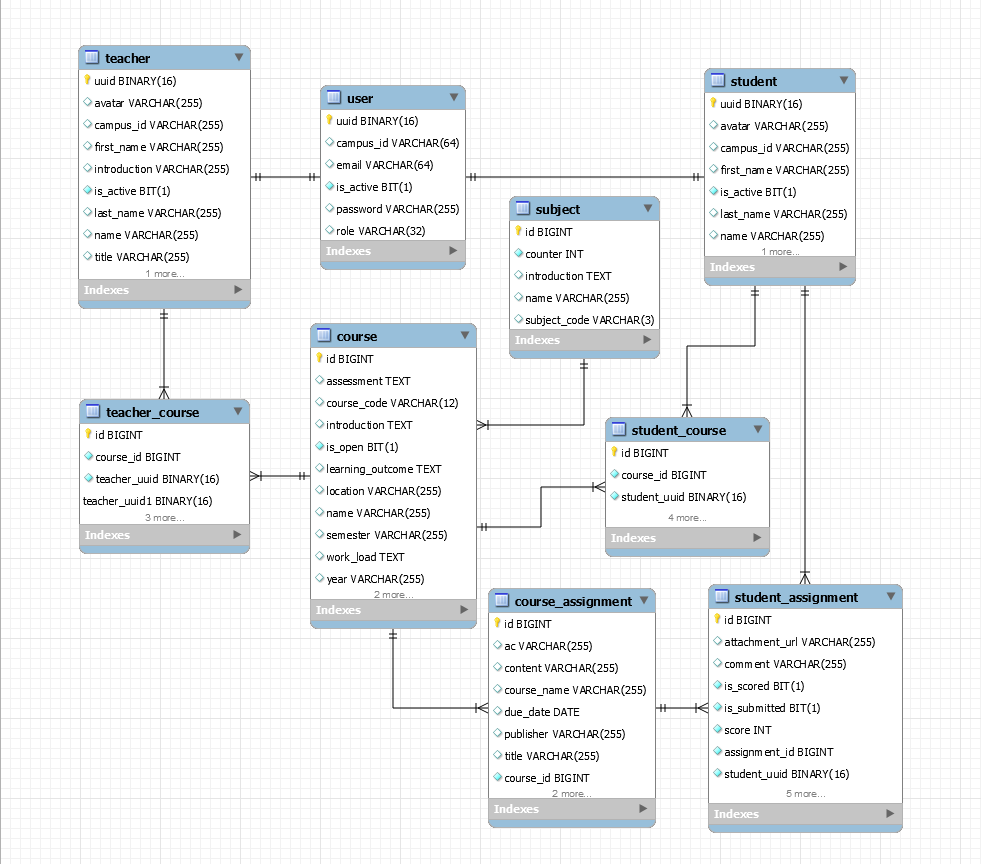

## JR Academy Projects 3 - Campus system 1.0
This is the backend project three from JR Academy. 
Objective of this project is to deliver a learning management system for an educational institution.

### What's new?

Added AWS based email function. 
Users will receive email upon register and change password. 

## Content
- [Introduction](#jr-academy-projects-3---campus-system-10)
- [What's new](#whats-new)
- [About](#about)
- [Tech Stack](#tech-stack-for-backend)
- [Database](#database)
- [Future Improvement](#future-improvement)

## About
This is project three from JR Academy. 
We are team RMR101. Objective of the project is to 
deliver a learning management system for an educational institution.

#### Backend Feature Summary
<ul>
<li>Secure log-in with encrypted password and JWT authentication</li>
<li>AWS document upload and download for handing assignments</li>
</ul>

## Tech stack for backend:

Framework:
- Spring Boot
- Maven

Testing:
- Swagger UI
- Jest & Jest-dom
- Testing library

Security:
- JSON Web Token

Clouds:
- AWS S3 & Presigned URL
- AWS SDK 
- AWS Simple Email Service

CI/CD:
- Java CI with Maven
- Docker/ Docker Hub

Development:
- Agile (Scrumn)
- Github flow

## Database
#### EER diagram

## Database Configuration(connect to Docker Hub)

- Start docker image:
    
    `docker run -itd --name mysql-test -p 3306:3306 -e MYSQL_ROOT_PASSWORD=123456 mysql`

- login container

    `docker exec -it mysql-test bash`

- login mysql

    `mysql -u root -p`
    input password
    
- create database
 
   `create database campus;`

## Swagger UI

- Step1: Start application 

- Step2: Access URL `http://localhost:8080/swagger-ui.html` in your browser

## Future Improvement
#### Features
<ul>
<li>generate a password reset email to users upon reset password request</li>
<li>allow multiple teacher to teach one course</li>
</ul>

#### Tech:
<ul>
<li>add an long expiry JWT as log-in credential</li>
<li>deploy to AWS for easy access and stronger security</li>
</ul>
